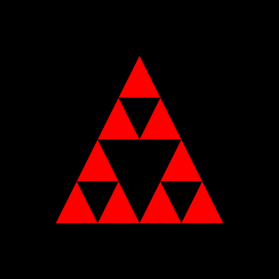

# sierpinski-triangle

## A library to create sierpinski gasket

### Installation
``` sh
$ npm install --save sierpinski-triangle
```

### How to use
To create a Sierpinski Triangle of depth 2, 
``` js
var sierpinski = require("sierpinski-triangle");

var pA = [0, 0.3];
var pB = [-0.2, -0.3];
var pC = [0.2, -0.3];
var depth = 2;
var sz = 3;

var res = sierpinski(pA, pB, pC, depth, sz);

console.log(res.pts); // The vertices of the triangles created in the format [x1,y1,0, ...]. Here since sz = 3, the 0 is appeneded in the array. If it would be 4, [..,0,1,..] would be appeneded.
console.log(res.cnt); // The number of vertices actually generated. Typically it is (3^(depth+1))

```

If you use these points as an input to a webgl application, you can see something as following
